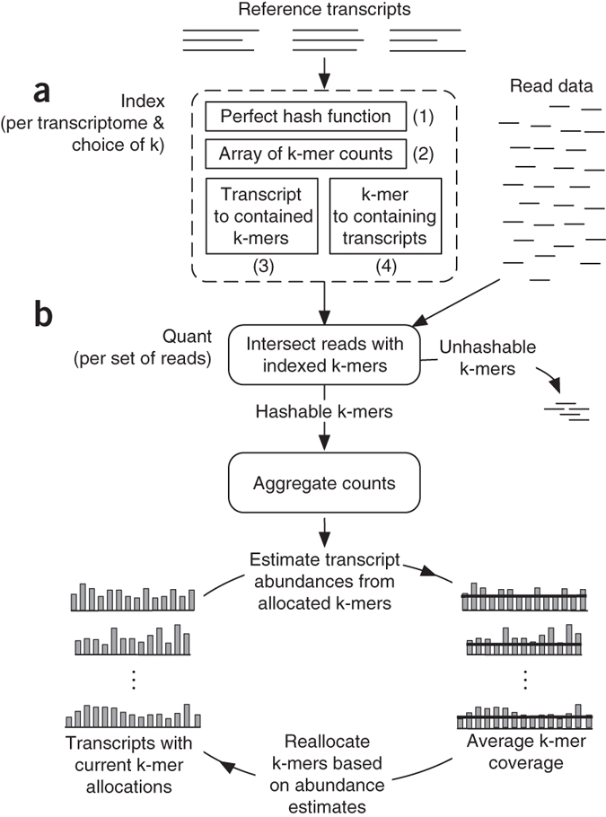
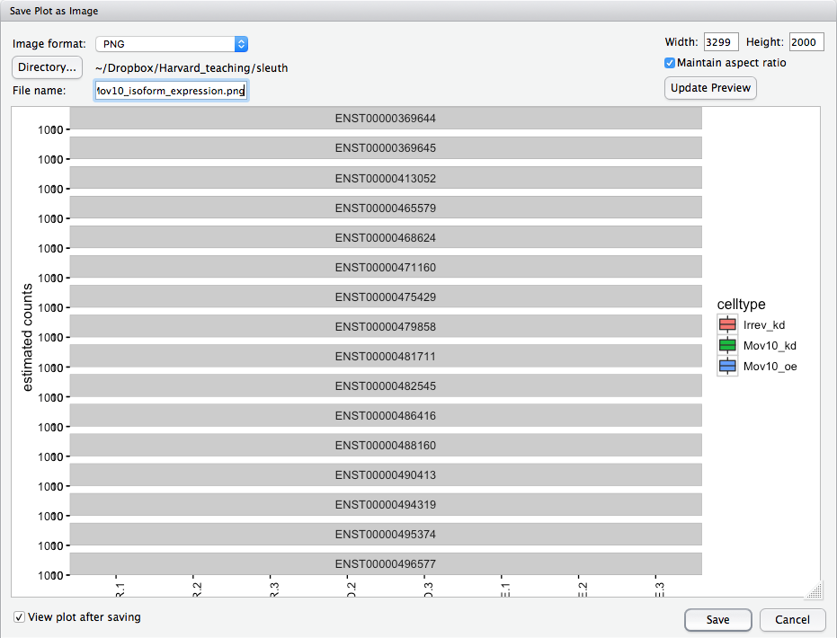
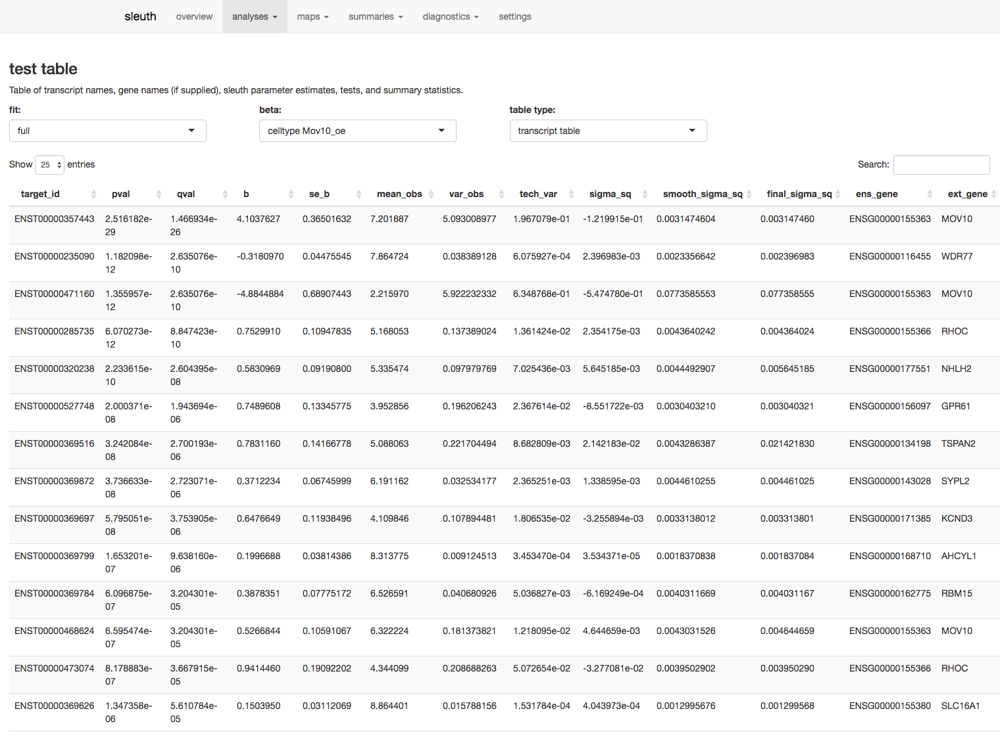
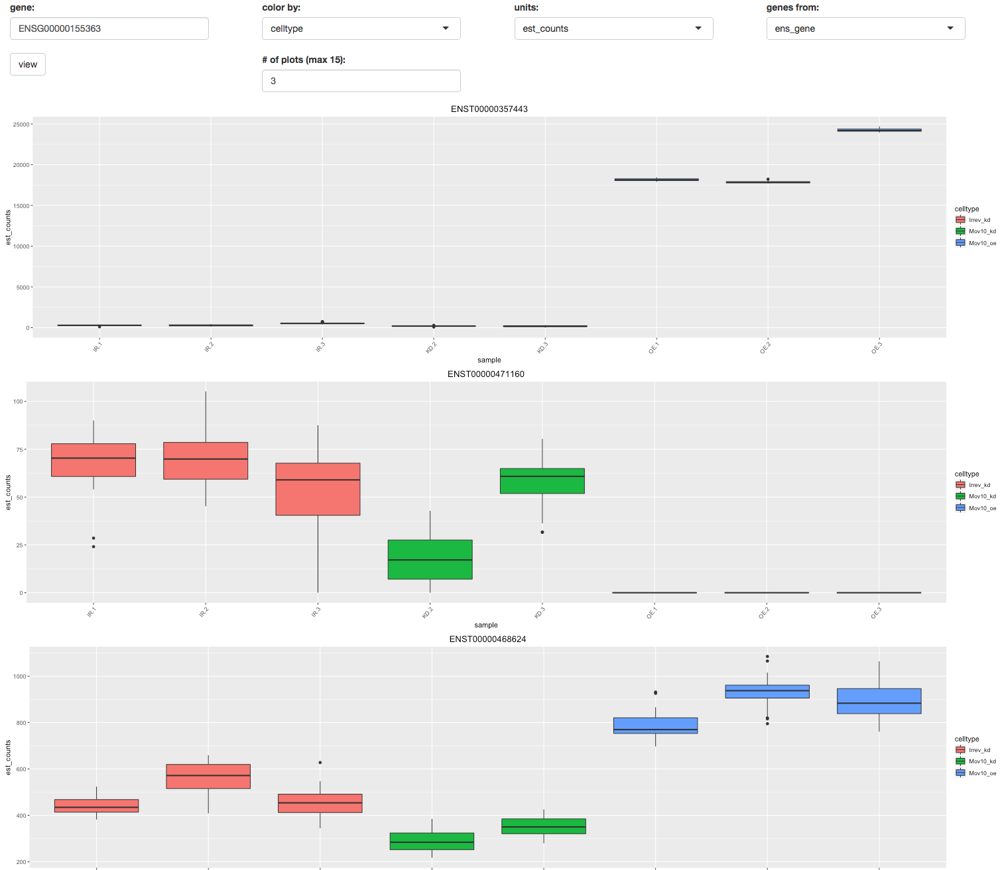

## Learning Objectives

* Using lightweight algorithms to quantify reads to Pseudocounts
* Understand how to use Sailfish to generate Pseudocounts
* Learn how to perform differential gene expression on Pseudocounts

## Alignment-free quantification of gene expression

In the standard RNA-seq pipeline that we have presented so far in this course, we have taken our reads post-QC and aligned them to the genome using our transcriptome (GTF) as guidance. The goal is to identify the genomic location where these reads originated from. Another strategy for quantification which has more recently been introduced involves **transcriptome mapping**. Tools that fall in this category include [Kallisto](https://pachterlab.github.io/kallisto/about), [Sailfish](http://www.nature.com/nbt/journal/v32/n5/full/nbt.2862.html) and [Salmon](https://combine-lab.github.io/salmon/); each working slightly different from one another. Common to all of these tools is that we **avoid mapping reads**, which is a time-consuming step, and **provides quantification estimates much faster than do existing approaches** (typically 20 times faster) without loss of accuracy. For this course we will explore Sailfish in more detail.


### What is Sailfish?

[Sailfish](http://www.cs.cmu.edu/~ckingsf/software/sailfish/index.html) and it's more recent "upgrade" [Salmon](https://combine-lab.github.io/salmon/), are based on the philosophy of lightweight algorithms. They use the sequence of genes or transcripts as input, and do not align the whole read. Instead it's a 2-step process based on counting "kmers":

**a.** they first evaluate the sequences for all possible unique sequences of length k (kmer) in the **transcriptome** (genes/transcripts) to create an index. The Sailfish index has four components: 

* (1) a perfect hash containing the number of unique k-mers per transcript 
* (2) an array recording the number of times each k-mer occurs in the reference set
* (3) an index mapping each **transcript to the multiset of k-mers** that it contains
* (4) an index mapping each **k-mer to the set of transcripts** in which it appears.

**b.** then they count the number of times those kmers appear in the **sequenced reads**, i.e. the fastq. This count information is used to figure out which transcript the read probably came from, and estimate the abundance of each gene or transcript. 



## Running Sailfish

As you can imagine from the above schematic, taken from [Patro R. et al, 2014](http://www.nature.com/nbt/journal/v32/n5/full/nbt.2862.html), there are 2 steps when running the analysis too:

a. "Index" the transcriptome (transcripts or genes) using the `index` command:
    
    $ sailfish index -p <num of cores> -k <kmer size> -t <fasta of gene sequences> 
                         -o <folder name>

b. Get the abundance using the quantification step using the `quant` command and the parameters described below (more information on parameters can be found [here](http://sailfish.readthedocs.org/en/master/sailfish.html#description-of-important-options):


   * `i`: specify the location of the index directory; for us it is `/groups/hbctraining/ngs-data-analysisSummer2016/rnaseq/sailfish.ensembl2.idx/`
   * `-l SR`: specify stranded single-end reads
   * `-r`: list of files
   * `--useVBOpt`: use variational Bayesian EM algorithm rather than the ‘standard EM’ to optimize abundance estimates (more accurate) 
   * `-o`: output quantification file name

To run the quantification step on a single sample we have the command provided below. Let's try running it on our susbet sample for `Mov10_oe_1.subset.fq`:

``` 
    $ sailfish quant -i <index> \
    -l SR \
    -r <fastq> \
    --useVBOpt \
    -o <name of output directory>
```

## Sailfish output

You should see a new directory has been created that is named by the string value you provided in the `-o` command. 
    
There is a logs directory, which contains all of the text that was printed to screen as Sailfish was running. Additionally, there is a file called `quant.sf`. This is the quantification file in which each row corresponds to a transcript, listed by Ensembl ID, and the columns correspond to metrics for each transcript:

```
Name    Length  EffectiveLength TPM     NumReads
ENST00000415118 8       4.79618 0       0
ENST00000434970 9       5.24851 0       0
ENST00000448914 13      7.01065 0       0
ENST00000604642 23      11.1044 0       0
ENST00000603326 19      9.51811 0       0
ENST00000604950 31      14.0891 0       0
ENST00000603077 31      14.0891 0       0
ENST00000605284 17      8.69981 0       0
....

```

 The first two columns are self-explanatory, the name of the transcript and the length of the transcript in base pairs (bp). 
 The effective length represents the the various factors that effect the length of transcript due to technical limitations of the sequencing platform. It is used in computing the TPM value. 
 The TPM, or Transcripts per Million is a normalization method as described in [1](http://www.ncbi.nlm.nih.gov/pmc/articles/PMC2820677/), and is meant as an estimate of the number of transcripts, per million observed transcripts, originating from each isoform. It's benefit over the F/RPKM measure is that it is independent of the mean expressed transcript length. The NumReads column lists the total number of reads that were counted for that transcript.
 
## Performing DE analysis on Pseudocounts

### tximport + DESeq2

The [tximport](https://www.bioconductor.org/packages/devel/bioc/html/tximport.html) package will convert Pseudocounts to values similar to raw count values, and combine transcript-level (splice isoforms) counts into gene-level counts. [DESeq2](https://bioconductor.org/packages/release/bioc/html/DESeq2.html) has a function available that can use these counts (not whole numbers) as input to DESeq2. Today we are not going to talk about using either of these tools, but do explore the links and test it out.

### Sleuth

#### What is Sleuth?

[Sleuth](http://pachterlab.github.io/sleuth/) is a fast, lightweight tool that uses transcript abundance estimates output from pseudo-alignment algorithms that use bootstrap sampling, such as Sailfish, Salmon, and Kallisto, to perform differential expression analysis of transcripts. 

The bootstrap sampling is required for estimation of technical variance. Bootstrapping essentially takes a different sub-sample of reads for each bootstapping run for estimating the transcript abundances. The technical variance is the variation in transcript abundance estimates calculated for each of the different sub-samplings (or bootstraps).

These bootstraps act as proxy for technical replicates and are used to model the variability in the abundance estimates due to "random processes underlying RNA-Seq as well as the statistical procedure of read assignment" [[1](https://rawgit.com/pachterlab/sleuth/master/inst/doc/intro.html), [2](http://biorxiv.org/content/biorxiv/early/2016/06/10/058164.full.pdf)].

Sleuth models the estimated (log) counts  using a linear model, but includes the technical variance (variance between bootstrapping runs) as a parameter in the model. Thereby, sleuth teases apart the source of the variance (technical vs. biological) for estimation of the "true" biological variance when determining whether transcripts are differentially expressed.

Sleuth was built to use the bootstrapped estimates of transcript abundance from Kallisto; however, abundance estimates from Sailfish (or Salmon) work just as well, as long as bootstrapping is performed. 

In addition to performing differential expression analysis of transcripts, the sleuth tool also provides an html interface allowing exploration of the data and differential expression results interactively. More information about the theory/process for sleuth is available in [this blogpost](https://liorpachter.wordpress.com/2015/08/17/a-sleuth-for-rna-seq/) and step-by-step instructions are available in [this tutorial](https://rawgit.com/pachterlab/sleuth/master/inst/doc/intro.html).

***NOTE:*** *Kallisto is distributed under a non-commercial license, while Sailfish and Salmon are distributed under the [GNU General Public License, version 3](http://www.gnu.org/licenses/gpl.html).*

#### Set-up for Running Sleuth

While Sailfish and Sleuth are lightweight algorithms that can be quickly run on a laptop [[2](https://rawgit.com/pachterlab/sleuth/master/inst/doc/intro.html)], it is more efficient to run Sleuth in an HPC environment. 

Since Sleuth was designed to use the output of Kallisto as input, our Sailfish transcript abundance estimates need to be massaged into the format of the Kallisto output. To do this, we are going to use the package [Wasabi](https://github.com/COMBINE-lab/wasabi). 

```
# Installing packages
source("http://bioconductor.org/biocLite.R")
biocLite("rhdf5")

install.packages("devtools")

devtools::install_github("pachterlab/sleuth")

install.packages("dplyr")

source("http://bioconductor.org/biocLite.R")
biocLite("COMBINE-lab/wasabi")
biocLite("biomaRt")

# When asked whether you want to "Update all/some/none?" Select `n` for none.
```

#### Setting up working directory and loading libraries

Before starting, create a new folder "sleuth" and set our working directory to that:

```
setwd("~/sleuth")
```
Load the libraries for wasabi and sleuth, sleuth also has a couple of dependencies and requires these other packages be loaded, as well: `biomaRt`, and `dplyr`:

```
library(wasabi)
library(sleuth)
library(biomaRt)
library(dplyr)
```

Download the `.sf` files from the sailfish run to the sleuth directory and decompress it. [Click here to download sailfish.zip.](https://github.com/rkhetani/Meetup/raw/master/sailfish.zip)

Also download the metadata file from [here](https://github.com/rkhetani/Meetup/raw/master/Mov10_full_meta.txt)

## Using Wasabi to convert Sailfish output for Sleuth

Now that we are set-up and our packages are installed, we can use Wasabi to convert the Sailfish (or Salmon) output into a Sleuth-compatible format. 

First, we create a simple vector containing the paths to the directories containing the transcript abundance estimates for each sample (folders containing the .quant files). We can use the `file.path()` function to give the paths to each of the directories to create our list of the paths to our transcript abundance files:

```
sf_dirs <- file.path("sailfish", c("Mov10_oe_1", "Mov10_oe_2", "Mov10_oe_3","Irrel_kd_1", "Irrel_kd_2", "Irrel_kd_3"))

sf_dirs
```

Now, we simply run the `prepare_fish_for_sleuth` function, which will write some status messages to the console and, when it's done, each directory will contain an `abundance.h5` file in a sleuth-compatible format.

```
prepare_fish_for_sleuth(sf_dirs)
```

Each of the sample directories should now contain the `abundance.h5` files. These 
files will be used as input to Sleuth.

## Sleuth for estimation of differential expression of transcripts

To run Sleuth, we not only need the transcript abundance files, but we also need the metadata file specifying which samplegroups the samples belong to, and any other metadata we want included in the analysis. To analyze isoform-level differential expression with Sleuth, we need to perform a series of steps:

1. Create a dataframe needed to generate the Sleuth analysis object:

  - columns containing any metadata to be in the analysis
  - a column named `sample` containing all of the sample names matching the names in the metadata file
  - a column named `path` containing the path to the abundance estimate files output from `wasabi`
        
2. Create a variable containing the model design 

3. Use biomaRt to create a dataset for Sleuth to query for Ensembl IDs and associated gene names

4. Fit the sleuth model incorporating the experimental design

5. Test for significant differences between conditions

### Step 1: Create a dataframe needed to generate Sleuth analysis object

#### Read in the metadata file 

Read in the metadata file and use the `data.frame()` function to ensure it is a dataframe:

```
# Read in metadata file

summarydata <- data.frame(read.table("meta/Mov10_full_meta.txt", header=TRUE, row.names=1), check.rows=FALSE)


```
#### Create dataframe to be used to generate the sleuth analysis object

Now, combine the metadata with the paths to the transcript abundance files to use as input for the Sleuth analysis. Sleuth expects the data to be presented in a specific format with specific column and row names; therefore, we will create the dataframe based on the sleuth requirements for analysis.

```
# Name the directory paths for the abundance files with their corresponding sample IDs
## Make sure the order of the `sfdirs` created above matches the order of samples in the `summarydata` rownames

names(sf_dirs) <- rownames(summarydata)

# Generate the dataframe to be used to create the sleuth analysis object

sfdata <- summarydata

sfdata$sample <- rownames(sfdata)

sfdata$path <- sf_dirs

sfdata
```

### Step 2: Provide the model design

Determine the covariates and/or confounders that should be included in your experimental design model. Sleuth can be used to analyze multiple conditions from complex experimental designs.

Within Sleuth, models are written similar to DESeq2 using the following syntax:

```
# DO NOT RUN
design <- ~ sex + treatment
```
This formula would test for the overall effect of treatment controlling for differences due to sex. The condition being tested is the last term added to the formula. 

More complex designs can be analyzed using Sleuth as well. For example, interaction terms can be added to the design formula to test if the effect attributable to a given condition is different based on another factor, for example, if the treatment effect differs
between sexes. To learn more about setting up design formulas for more complex designs, see the [DESeq2 tutorial](https://www.bioconductor.org/packages/devel/bioc/vignettes/DESeq2/inst/doc/DESeq2.pdf) (chapter 3 discusses complex experimental designs). There is also a [recent post](http://nxn.se/post/134227694720/timecourse-analysis-with-sleuth) describing the use of Sleuth to perform time course analyses. While Sleuth has much flexiblity in design models, it is unable to support some complex designs, such as nested models.

Since the only condition we plan to test is our sample type, our design formula is very simple:

```
design <- ~ sampletype
```

### Step 3: Create Biomart dataset to query

Obtain the Ensembl transcript/gene IDs and gene names for annotation of results by using the biomaRt package to query the Ensembl genome database. BiomaRt allows extensive genome information to be accessible during an analysis.

```
# Using biomaRt, ensure host is the appropriate version since the main portal (www.ensembl.org) is not accessible from Orchestra

## Specify that the database to query is the human gene database

mart <- useMart(biomart = "ENSEMBL_MART_ENSEMBL",dataset="hsapiens_gene_ensembl", host = "dec2015.archive.ensembl.org") 	  #feb2014=build 37

## Specify the information to return

t2g <- getBM(attributes = c("ensembl_transcript_id", "ensembl_gene_id", "external_gene_name"), mart = mart)

## Rename the columns for use in Sleuth

t2g <- dplyr::rename(t2g, target_id = ensembl_transcript_id, ens_gene = ensembl_gene_id, ext_gene = external_gene_name)
```
### Step 4: Fit the sleuth model incorporating the experimental design

#### Fit the transcript abundance data to the Sleuth model

```
# Create sleuth object for analysis 

so <- sleuth_prep(sfdata, design, target_mapping = t2g) 

# Fit the transcript abundance data to the sleuth model

so <- sleuth_fit(so)

# NOTE: alternatively the two prior steps could have been run as: "so <- sleuth_prep(sfdata, design, target_mapping = t2g) %>% sleuth_fit()

```

#### Check which models have been fit and which coefficients can be tested

Ensure the design model and coefficients are correct for your analysis.

```
models(so)
```
> **NOTE:** Sleuth will automatically use the first level (alphabetically) in the factor variable being tested to compare all other conditions against (in our metadata, this is 'control'). If you want to use a different condition to be the base level, then you would need to use the relevel() function to change the base level of the variable in step 1 above. For example, if we wanted the base level of `sampletype` to be "MOV10_knockdown", we could use the following code:
>```
> summarydata$sampletype <- relevel(summarydata$sampletype, ref = "MOV10_knockdown")
>```
>***An ordered factor will not give interpretable output, so do not order the factor using the factor() function, use relevel() instead.***


### Step 5: Test significant differences between conditions using the Wald test

```
# Wald test for specific condition

oe <- sleuth_wt(so, 'sampletypeMOV10_overexpression')

# output results

sleuth_results_oe <- sleuth_results(oe, 'sampletypeMOV10_overexpression', show_all = TRUE)
```

### Save R objects to file to transfer to local machine

Now that we have all of the analyses performed, we need to bring the output to our local machines for further exploration. The `save()` function works to write an R object to file, and takes the files to include in the R object as arguments.

```
save("oe", "summarydata", "sleuth_results_oe", file="sleuth/oe.RData")
```

## Exploration of differential expression results

### Set-up for R session
Before we begin to explore our results, we need to copy over the `oe.RData` file to our local machine using Filezilla or `scp`.

If using `scp`, you need to open the Terminal on the local machine and type:

```
$ scp username@transfer.orchestra.med.harvard.edu:/home/username/ngs_course/rnaseq/sleuth/oe.RData Desktop
```
While the R object is transferring (it may take a few minutes), open up RStudio and create a new project called `sleuth`. 

Within RStudio we need to install and load Sleuth similar to what we did on Orchestra:

```
# Install the sleuth package on your local machine

source("http://bioconductor.org/biocLite.R")
biocLite("devtools")    # only if devtools not yet installed
biocLite("pachterlab/sleuth")

# Load the sleuth library

library(sleuth)
```

After the R object has successfully transferred, you can load the object into your new R project using `load()` or by double-clicking on the `oe.RData` object in the RStudio file directory:

```
load("~/Desktop/oe.RData")
```

Move `oe.RData` into the `sleuth` folder.

### Exploring transcript-level expression between samples

Now that we have our environment set up, we can perform some exploratory analyses. 

#### Visualization of transcript expression for a single Mov10 isoform

Let's get the transcript expression values for Mov10 transcript "ENST00000357443". We would like to observe technical and biological variation between the samples, so we need to attain the expression estimates for each bootstrap sampling for every sample using the `get_bootstraps()` function in sleuth:

```
boot_mov10_443 <- get_bootstraps(oe, "ENST00000357443")
```

If we view `boot_mov10_443`, we will see the estimated counts (est_counts) and Transcripts Per Million (tpm) values for each bootstrap of every sample. We can visualize the estimates and distributions:

```
ggplot(boot_mov10_443, aes(sample, est_counts + 1, fill = sampletype)) + 
        geom_boxplot() + 
        facet_wrap(~target_id, ncol = 1) + 
        theme_bw() + 
        scale_y_log10() + 
        theme(axis.text.x = element_text(angle = 90, hjust = 1)) + 
        ylab("estimated counts") + 
        xlab("")
```

The technical variation associated with the transcript abundance estimates for each sample is represented by the box plots. The biological variation is observed by viewing across biological replicates.

While this isoform of Mov10 shows the expected pattern of expression, with high expression in the Mov10 over-expressed samples and lower expression in the Mov10 knockdown samples. We can look at the other isoforms of Mov10 as well. 

To get the transcript IDs of all Mov10 transcripts, we can subset the dataset to those rows with gene names of "MOV10" and only return the transcript IDs. We can use the `drop` argument to return a vector instead of a dataframe:

```
mov10 <- subset(sleuth_results_oe, ext_gene == "MOV10", select=target_id, drop=T)
```

Now we would like to get the bootstraps for each transcript in this `mov10` vector. The easiest way to do this is using a `for loop`. 

#### For loops in R

"For loops" in R are very similar to using the command line, and follow the syntax:

```
# DO NOT RUN

for (variable in list){
    commands
}
```
You can think of the `{` as `do` and `}` as `done` in the command line. For example, we can list the names of each transcript in the `mov10` vector as follows:

```
for (transcript in mov10){
    print(paste("The transcript ID is", transcript))
}
```
You can issue as many commands as you wish inside the "for loop". 

#### Visualization of transcript expression for all Mov10 isoforms  

Now that we know how a "for loop" works in R, let's run `get_bootstraps()` on each mov10 transcript and save the output of each iteration in a file, `df`:

```
# Create dataframe to add transcript abundance estimates to

df <- data.frame()

# Get bootstraps for each transcript of Mov10

for(transcript in mov10){
    df <-rbind(df, get_bootstraps(oe, transcript))
}
```

> NOTE: 'For loops' in R are often not the most efficient way to perform complex operations. Often try to find a different function to use in place of using a 'for loop', such as a function in the `apply` family. A blog post explaining how to avoid 'for loops' in R is [available](http://www.r-bloggers.com/for-loops-and-how-to-avoid-them/). We performed a simple 'for loop', so it was pretty straight-forward, but we could have performed the same operation using the following code:

```
# DO NOT RUN
bootstraps <- lapply(mov10 , function(x){get_bootstraps(so, x)})
df <- do.call(rbind, bootstraps)
```

Similar to the single Mov10 isoform, we can plot the estimates and distributions for all isoforms of Mov10 as follows:

```
ggplot(df, aes(sample, est_counts + 1, fill = sampletype)) + 
        geom_boxplot() + 
        facet_wrap(~target_id, ncol = 1) + 
        theme_bw() + scale_y_log10() + 
        theme(axis.text.x = element_text(angle = 90, hjust = 1)) + 
        ylab("estimated counts") + 
        xlab("")
```

This plot is difficult to see in the "Plots" window. Let's export the image as a PNG using the setting displayed below:



Click on the "Plots" tab, and click on the "Export" drop-down menu. Choose "Save as image". In the "Save plot as image" window, the image format should be PNG, the file name should be "Mov10_isoform_expression.png". The box should be checked for "Maintain aspect ratio", and the "Height" should be "2000". 

While we can explore our results manually, sleuth offers us the option to explore the data and results interactively using a web interface. 

```
sleuth_live(oe)
```

Using this web interface, we can explore diagnostic plots and summaries of experimental factors and expression levels. We also have the ability to perform clustering analyses such as PCA and heatmaps. Finally, we can analyze the differential expression results by plotting MA and volcano plots and by exploring expression levels at the transcript and gene levels.

Explore the results table under the `analyses` tab, `test table`.



Look at the expression levels of Mov10 for three different isoforms using the `analyses` tab, `gene view`. Look for the Mov10 gene, ENSG00000155363. Compare expression of the different isoforms of Mov10.




***
*This lesson has been developed by members of the teaching team at the [Harvard Chan Bioinformatics Core (HBC)](http://bioinformatics.sph.harvard.edu/). These are open access materials distributed under the terms of the [Creative Commons Attribution license](https://creativecommons.org/licenses/by/4.0/) (CC BY 4.0), which permits unrestricted use, distribution, and reproduction in any medium, provided the original author and source are credited.*
